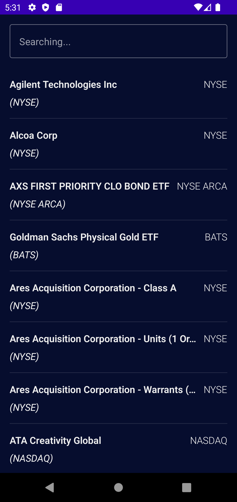
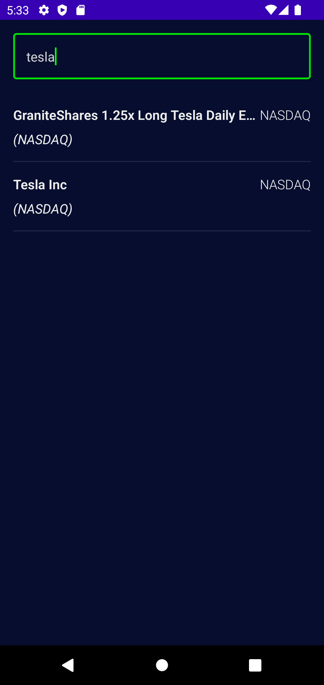
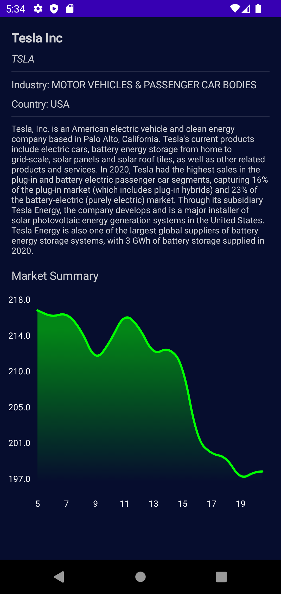

StockMarket
===========

An application that shows joining stock company listings and detail info.

A solid app with relevant concepts: 
* Clean architectural
* DI with Dagger-Hilt
* CSV parsing with OpenCSV
* Working with remote APIs using Retrofit
* Local caching with Room
* Custom drawing on a canvas using Compose

Getting Started
---------------

StockMarket uses the Stock Market Data APIs from Alpha Vantage to load data throughout the app. To use the API, you will need to obtain a API key. See the
[Stock Market Data APIs](https://www.alphavantage.co/) for instructions.

The app can not work properly without an API key.

Screenshots
-----------

